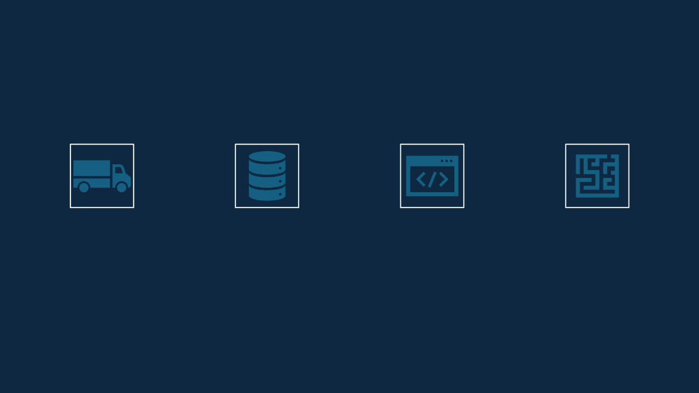

Sistema de             Automatización de Carga de Datos y Modificación 

de Reportes en el Almacén de Datos

- Integrantes:
- 1.-Ccalli Chata, Joel Robert
- 2.-Anahua Coaquira , Mayner Gonzalo
- 3.-Zeballos Purca, Justin Zinedine
- 4.-Paco Ramos Aaron Pedro
- 5.-Salinas Condori, Erick Javier

Introducción

- **Propósito**: El propósito de este proyecto es  desarrollar un sistema automatizado que  facilite la carga, almacenamiento y  modificación de datos en archivos CSV, así  como la generación y actualización de  reportes en un almacén de datos. 
- **Alcance**: El proyecto incluye el desarrollo  de un sistema de automatización de carga  de datos, modificación de reportes,  capacitación de usuarios, pruebas y  validación del sistema. 

  Generalidades de la Empresa

- **Nombre de la Empresa**: AOE-System 
- **Visión**: Definir y establecer un sistema  eficiente y automatizado para la carga de  datos, optimizando los procesos de  almacenamiento y reporte en la  organización. 
- **Misión**: Implementar una solución de  automatización de carga de datos y  modificar los reportes existentes para  mejorar la precisión, eficiencia y  accesibilidad de la información  almacenada.

     

**DESCRIPCIÓN DEL  OBJETIVOS DE**  MEJORAR LA EFICIENCIA  AUMENTAR LA  FACILITAR EL ACCESO A  REDUCIR LOS COSTOS **PROBLEMA**: EL PROCESO  **NEGOCIOS**: OPERATIVA REDUCIENDO  PRECISIÓN Y  INFORMACIÓN  OPERATIVOS ASOCIADOS DE CARGA DE DATOS ES  EL TIEMPO DE CARGA DE  CONSISTENCIA DE LOS  ACTUALIZADA Y  A LA GESTIÓN MANUAL 

MANUAL Y PROPENSO A  DATOS. DATOS ALMACENADOS. CONFIABLE PARA LA  DE DATOS. ERRORES, RESULTANDO  TOMA DE DECISIONES.

EN RETRASOS Y 

PROBLEMAS DE 

PRECISIÓN EN LOS 

REPORTES.

•**Alcance del Proyecto**:

Desarrollo e implementación de un sistema ![ref1]automatizado de carga de datos.

Modificación del reporte de la unidad 1 para que ![ref1]utilice el nuevo almacén de datos.

Capacitación a los usuarios sobre el nuevo sistema.![ref1]

Pruebas y validación del sistema para garantizar ![ref1]su correcto funcionamiento.

•**Objetivos de Diseño**:

Crear un sistema de       automatización para la carga de datos.

Modificar los reportes existentes para que apunten al nuevo almacén de datos.

Asegurar la integración y compatibilidad con los sistemas existentes.

Garantizar la escalabilidad del sistema para futuros requerimientos.

**Diagrama del Proceso  Diagrama del Proceso Actual**: Incluye la  **Propuesto**: Incluye la descripción y  descripción y          representación gráfica del  representación gráfica del proceso actual de carga y  proceso automatizado    manejo de datos. propuesto.

El sistema debe  

**Requerimientos**  permitir la carga  Debe validar los datos  integElr sar isltoems da adtoebs en ee  l  Deben e casogener de ar erraloertresas **Funcionales**  automática de datos  durante el proceso de  almacén de datos de  durante la carga de 

**Iniciales**: desde múltiples  carga. manera estructurada. datos.

fuentes.

Debe permitir la  

cElapaz dc sisargtema as de pe rdeodgaberamar toser s  al nuevo almacén de  **RequeriFuncimionentalesos** : **No**  cmanrecientesejcalar able esvodlúe pmedaraa ntoess.  dDebispoe ntibener ilidadun(9a al9.9ta % 

modificación de  El sistema debe ser 

reportes para apuntar 

periódicas. datos. uptime).

El tiempo de  

respuesta para la  El sistema debe carga de datos no  cnormumplir ativcon las das e

debe exceder los 10  seguridad de datos. minutos.

El sistema debe permitir la configuración de reglas de validación de datos personalizadas.

Debe soportar la carga de datos en tiempo real.

**Requerimientos**  El sAPIsis.tema debe permitir la extracción y carga de datos mediante **Funcionales**  Debe proporcionar opciones de transformación de datos durante 

**Finales**: lEla c siarstgema. a debe permitir la replicación de datos a otros 

almacenes de datos.

El sistema debe permitir la administración de permisos de usuario para la carga de datos.

Debe integrar una solución de backup y recuperación de datos automatizada.

 

SOLO LOS USUARIOS AUTORIZADOS  LOS DATOS DEBEN PASAR POR PUEDEN INICIAR PROCESOS DE CARGA  VALIDACIONES PREDEFINIDAS ANTES 

DE DATOS. DE SER ALMACENADOS. **Reglas de** 

**Negocio**:

LAS CARGAS DE DATOS FALLIDAS  LOS REPORTES DEBEN SER DEBEN SER NOTIFICADAS AL  ACTUALIZADOS AUTOMÁTICAMENTE 

ADMINISTRADOR DEL SISTEMA. TRAS CADA CARGA DE DATOS EXITOSA.

Fase de Desarrollo

    

**PERFILES DE USUARIO**: ADMINISTRADOR DEL  ANALISTA DE DATOS:  USUARIO FINAL:  **MODELO CONCEPTUAL**:

SISTEMA: RESPONSABLE  UTILIZA EL SISTEMA PARA  CONSULTA LOS 

DE LA CONFIGURACIÓN  CARGAR DATOS Y  REPORTES GENERADOS 

Y MANTENIMIENTO DEL  GENERAR REPORTES. PARA LA TOMA DE 

SISTEMA. DECISIONES.

  

**DIAGRAMA DE  DIAGRAMA DE CASOS  ESCENARIOS DE CASO PAQUETES**:  **DE USO**:  **DE USO (NARRATIVA)**: 

AGRUPACIÓN DE  REPRESENTACIÓN DE  DESCRIPCIÓN 

ELEMENTOS DEL  LAS INTERACCIONES  DETALLADA DE LOS SISTEMA POR  ENTRE LOS ACTORES Y  FLUJOS DE TRABAJO DEL 

FUNCIONALIDAD. EL SISTEMA. SISTEMA.

**Análisis de Objetos**: Detallado análisis y 

descripción de los objetos que 

forman parte Modelo Lógico

del sistema.

**Diagrama de Actividades Diagrama de Clases**:  **con Objetos**: 

Representación estática de  Representación gráfica de las clases del sistema y sus  las actividades y su 

relaciones. secuencia con los objetos involucrados.

**Diagrama de Secuencia**: Diagrama que muestra la    interacción entre los     objetos a lo largo del     tiempo.

Conclusiones ![ref2]

- La implementación del sistema  mejorará significativamente la  eficiencia, precisión y  accesibilidad de la información  en la organización, apoyando  una mejor toma de decisiones y  optimizando los procesos  operativos. 

Recomendaciones ![ref2]

- Realizar una capacitación adecuada  para todos los usuarios del sistema. 
- Implementar un plan de monitoreo  continuo para garantizar el rendimiento y  la seguridad del sistema. 
- Realizar revisiones periódicas del  sistema para identificar y solucionar  posibles problemas. 
- Planificar actualizaciones futuras para  mantener el sistema alineado con las  necesidades de la organización. 

Bibliografía - Webgrafía

- Kimball, R., & Ross, M. (2013). The Data Warehouse Toolkit:  The Definitive Guide to Dimensional Modeling. Wiley. 
- Inmon, W. H. (2005). Building the Data Warehouse. Wiley. 
- Elmasri, R., & Navathe, S. B. (2015). Fundamentals of  Database Systems. Pearson. 
- **Amazon S3**: [https://aws.amazon.com/s3/ ](https://aws.amazon.com/s3/)
- **AWS IAM**: [https://aws.amazon.com/iam/ ](https://aws.amazon.com/iam/)
- **Inteligencia de Negocios**:  [https://en.wikipedia.org/wiki/Business_intelligence ](https://en.wikipedia.org/wiki/Business_intelligence)

[ref1]: Aspose.Words.d8d81e72-408a-45d9-af20-dbaba7c1ea11.015.png
[ref2]: Aspose.Words.d8d81e72-408a-45d9-af20-dbaba7c1ea11.057.png
